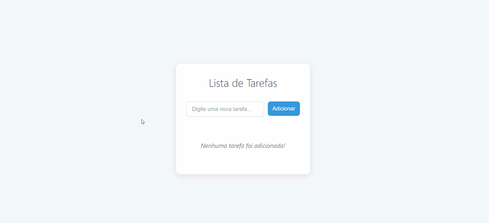

# Projeto to-do-list com React

Este projeto tem como objetivo criar uma lista de tarefas a serem realizadas pelo usuário, a pessoa conseguirá adicionar as tarefas e a medida que forem realizando-as poderá excluir as tarefas da list. Lembrando que essa lista serve tanto para quem está utlizando algum computador dektop ou um dispositivo móvel como celulares e notebooks.

## Tecnologias Utilizadas

- HTML
- CSS
- REACT
  
## Dificuldades encontradas

Acredito que o maior aprendizado que tive com o projeto foi fazer o gerenciamento das tarefas utilizando um array e hooks do react para atualizar a lista de tarefas toda vez que o usuário fizesse uma alteração na lista.